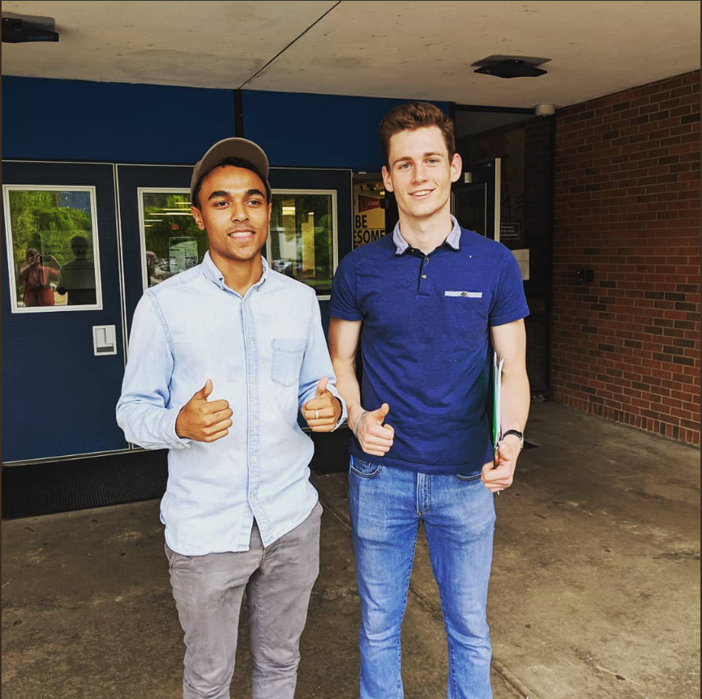
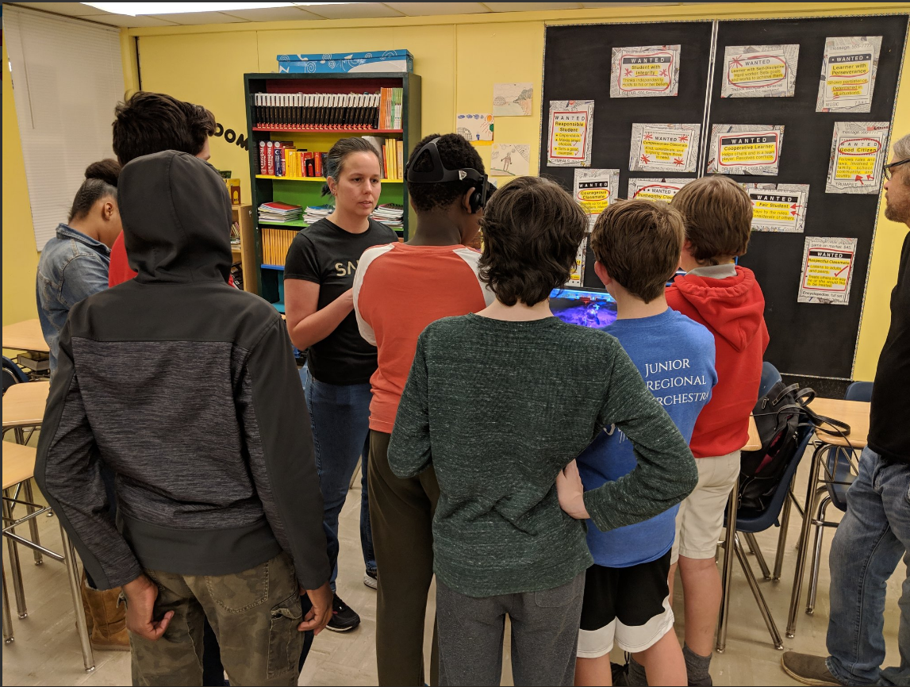
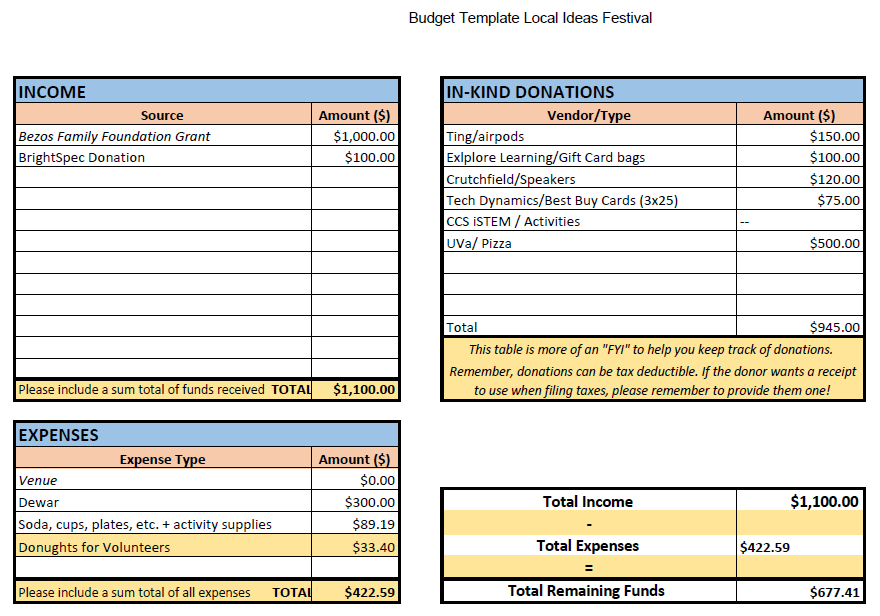

# Buford-STEM-Night
Buford STEM Night is an event created through Engineering Capstone with the goal stimulating STEM engagement that represents the demographics of Buford Middle School. The focus is to increase general interest in STEM classes, activities, and clubs at Buford and CHS.

After about 7 months of deciding on a direction, soliciting sponsors, designing workshops, and planning the event, the first annual Buford STEM Night was held April 25th, 2018 at Buford Middle School from 5:30 - 7:30. The event was open to all students and featured 10 unique, small-group workshops designed by UVa students, CHS students, and local tech firms.

The event was created by Cole Fairchild and Dani Szabo, with mentorship from Matthew Shields. The second year was run by Dani Szabo. Original [wiki page](http://wiki.chssigma.com/index.php?title=Capstone_Project:_Buford_STEM_Night).

# Table of Contents
<!-- TOC -->
- [Buford-STEM-Night](#buford-stem-night)
- [Table of Contents](#table-of-contents)
- [Introduction](#introduction)
- [Objectives](#objectives)
    - [The Bigger Picture](#the-bigger-picture)
        - [Vision:](#vision)
        - [Mission:](#mission)
        - [Goals:](#goals)
    - [The Event](#the-event)
- [Planning](#planning)
    - [Sponsor Search & Workshop Curation](#sponsor-search--workshop-curation)
    - [Space Planning](#space-planning)
    - [Volunteers & Availability](#volunteers--availability)
    - [Logistics](#logistics)
- [Execution](#execution)
    - [Advertising & Target Audience Search](#advertising--target-audience-search)
    - [Providing for Workshops](#providing-for-workshops)
    - [Running the Show](#running-the-show)
    - [Reflections & Notes](#reflections--notes)
- [Deliverables](#deliverables)
    - [Run of Show](#run-of-show)
    - [Workshop Descriptions](#workshop-descriptions)
    - [Rotations](#rotations)
    - [Student Schedules](#student-schedules)
    - [Responses & Group Sorting](#responses--group-sorting)
    - [Flyer](#flyer)
    - [Sponsor Sheet](#sponsor-sheet)
    - [Workshop Spreadsheet w/Contacts](#workshop-spreadsheet-wcontacts)
    - [Registration Form](#registration-form)
    - [Contact Spreadsheet](#contact-spreadsheet)
- [Pictures](#pictures)
- [Project Management](#project-management)
- [Budget](#budget)
- [Future Steps](#future-steps)
    - [Objectives](#objectives-1)
        - [Summer/Post Event](#summerpost-event)
        - [Following Year](#following-year)
- [File Trove](#file-trove)
<!-- /TOC -->
# Introduction 
Our Capstone Project, Buford STEM Night, is an event born out of the Bezos Scholars experience and grant taken on by Cole Fairchild and Matt Shields. After a week of leadership training and talks from notable minds during the Aspen IDEAS Festival, the Bezos Family Foundation issued a $1000 grant for the team to design and execute their own impact event (Local Ideas Festival) focused around an issue or challenge specific to their community. Our names are Cole Fairchild and Dani Szabo, and we took this idea and built it into fruition as our Capstone Project for Engineering V.

There exists a quintessential problem at CHS that has existed throughout my time in the school system and will continue for a long time. It is not an issue unique to our school at all (but it’s worse than usual), but one that remains a scar from a troubled history: segregation. The deep-rooted problem of a racial achievement gap at Buford Middle School and Charlottesville High School is marked by a lack of diversity in STEM (and AP) classrooms. The gap grows at Buford Middle School; there is especially a large drop in STEM involvement through higher order classes going from the 8th to the 9th grade. Significant buzz and data have been released nationally about the achievement gap in Charlottesville specifically: [[1]](https://www.nytimes.com/2018/10/16/us/charlottesville-riots-black-students-schools.html)

The “STEM Night” inspiration and blueprint came from a series of events held by Charlottesville School’s iSTEM program at all the local elementary schools. We attend every year to volunteer and were always struck by how different the turnout looked than at the High School: a general interest in science and math at school drove an attendance of students and families remarkably representative of the school’s larger demographics. Given, more participation comes with younger age groups, but we wanted to replicate that same energy and excitement in an event that would speak to 6th-8th graders.
# Objectives
There were two sets of objectives for this project: the bigger-picture ones that inspired the project, meant to be guiding the overarching direction of the event, and the objectives for executing a smooth, successful event. As we moved through the process and worked harder on the actual event, our understanding of the true objectives evolved from fixing the larger issues determined in our mission to securing good workshops and getting people in the door. We weren’t agnostic as to what demographics showed up, but limited time forced our priorities the shift.
## The Bigger Picture
### Vision:
To eradicate the homogeneity in high-level STEM classes at Buford Middle School and CHS through demographically representative enrollment in AP and DE courses and participation in STEM-oriented extra-curricular activities.
### Mission: 
To inspire passion for STEM in the marginalized population of middle-schoolers through collaboration, learning, and excitement.
### Goals: 
Increase Engineering 1 class enrollment rates at Buford Middle School that mirror the demographics of the rest of the school within 5 years. We hope to generate new interest from the kids that attend the LIF.
## The Event
- Have 200 Buford Middle School students and parents attend the event on the day of. This is a reasonable goal as discussed with Mr. Martin
- Source or create 10 unique workshops focused around exciting aspects of STEM as they relate to resources available in the community.
- Provide food for all attendees and at least 5 raffle items.
- Generate attendance from minority groups through local organizations (City of Promise, Boy’s and Girl’s Club, NSBE, 100 Black Men, e
# Planning
In the brainstorming process, it became evident fairly quickly that the focus of our event would be on equity and inclusion within our school community, specifically oriented towards STEM education. The homogeneity in upper-level classes at CHS has been an apparent problem for a while, but an even larger problem that we saw was the homogeneity in high-level STEM classes. Some of the STEM classes are particularly cutting-edge at the school, and the lack of diversity in those classes means that a large demographic of students do not interact with some of the school’s best resources. Everything - the articles, city council meetings, and our personal research - pointed us towards solving this problem.

We landed on a STEM Night after having seen the success of similar events at the elementary schools. To figure out the format, we discussed a two main options:
- Expo-Style
- Workshop Format

We initially pursued the expo-style event, because we knew that we could accomplish a few things with such a format. Namely, the event needed to build excitement amongst the students, engage parents, be connected to the school (principal, teachers) and be to our target demographic. Under an expo-style event, we wanted to have local tech companies, UVa students groups, Buford students, CHS students, and other local organizations set up tables that people could view. With a large enough amount of tables, the sheer size of the event could build excitement and offer insights into the opportunities STEM could provide. However, we encountered a few difficulties:
- Engaging local organizations
- Figuring out how to ensure student engagement at the event
Due to this, we decided to shift to a format where students would participate in numerous 15-20 minute workshops, with food provided and a raffle. The other decision was to make the event students-only as to make the most space and create an environment where students felt comfortable (in retrospect, if space permits allow parents to keep students in check and learn alongside). The workshops would force students to engage in the sessions, the food would draw students to the event, and the raffle would build excitement and chatter among the student population, especially if we secured good items.

After we decided on the workshop event, we focused on the following points:
- Sponsor Search
- Workshop Curation
- Space Planning
- Volunteers and Availability
- Logistics
## Sponsor Search & Workshop Curation
In our sponsor search, we contacted as many groups as possible, specifically, ones we knew as either large or developing products that would excite students. We searched through the CBIC, which we knew held a tech tour of local companies. We solicited help through either providing a 15-20 minute workshop that could engage 10-15 students or through a raffle donation, as many companies have funds for community outreach. Ultimately, all the companies we heard back from minus a few were able to provide workshops or raffle items that fit the theme of the event.
## Space Planning
To plan the space, we drew a small layout of the science hallway at Buford, and fit each workshop with the space it needed. We got this information by emailing workshops about any specific needs they had, and if they did we accommodated them. Getting information ahead of time was key, as some groups, like Computers 4 Kids, needed high ceilings or outside space.
## Volunteers & Availability
We knew we’d need volunteers helping to set up signs and running the CHS workshop, so we asked for help through BACON and other organizations such as SWE, CBIC, and The Virginia-North Carolina Alliance. The best strategy here was casting a wide net through emails asking for help. Because of our inexperience, we didn’t know how much help to ask for, but it turned out we were somewhat overstaffed. Dependent on size, I would recommend a solidly prepped group of 10 volunteers who have specific jobs. One issue we had was that a lot of volunteers didn’t know what to do and we were so busy we didn’t have time to direct them. Don’t overlook planning this step.
## Logistics
One key to festival success for our chosen event format was logistics: making sure kids got proportionally assigned to rooms based on interest and coordinating a smooth transition from workshop to workshop.

We managed the workshop assignment process by printing a set number of “tickets”(sample link below) for each scheduled rotation of 4 workshops. With 10 unique workshops, there were 10 rotations of students (1-4, 2-5, 3-6, etc.) and for a max of 150 students, we printed 15 schedules per rotation, this way we could evenly distribute them as kids came in and know when max capacity was reached when we ran out of tickets.

This process was made a lot easier through our pre-registration process as attendees could choose what workshops interested them when they registered. With that information uploaded to a spreadsheet via Google Forms, I was able to pre-sort students into groups. I had the list of students and their preferences and went through in sections to individually match the students with the most preferences possible by checking the schedule to see which rotations allowed. Though it worked well, this process was inefficient and could be optimized through a computer program or a better system. All walk-ins were processed with a short google form that took their name and grade for records and the raffle selection.

In the end, the methodology behind the logistics proved quite successful: tickets were evenly dispersed, requiring a ticket to get pizza forced student to get a ticket, and registration ran smoothly. However, the execution turned out to be flawed in practice. With no rosters for each workshop students roamed as they pleased with their friends. This left some workshops with 1-2 students in some time slots and others very full. It turned out to be fine since we were well under the caps for each workshop, but a better process for keeping track of students will be necessary as the event grows in size.
# Execution
## Advertising & Target Audience Search
In execution, the main point was attempting to get our key demographic of students to the event. To advertise, we sent out an all-call to Buford families, put a flyer out in the Buford Trojan, and went to Buford to hand out flyers at lunch. We managed to get a 20-30 students to register at lunches, however, a majority of these students ultimately did not attend the event. This can be attributed to the fact that the parents could not see their child register, and therefore couldn’t provide them with transportation. In addition, the turnout at the event reflected the fact that communication with students was not enough to ensure they attended the event. However, going to lunches and specifically advertising the raffle items and food did help build excitement among the students and get them talking about the event. The flyer and the all-call were deemed helpful, but we had no measure of how many parents actually heard the phone call. Finally, contacting the City of Promise and visiting them a few times and contacting the Boys & Girls Club proved helpful. The City of Promise specifically was able to bring about 5-10 students of color. This is invaluable as next year those students who are still with the City of Promise can come again and vouch for the event.

In the future, it will be important to provide better hospitality for the workshop providers and for any volunteers like the VA North Carolina Alliance. More targeted advertising through research will also be important.
## Providing for Workshops
To ensure that workshops understood their role at the event, we printed an information sheet and put it in each room. The sheet contained schedule information, our contact information in the event student’s misbehaved, and some additional notes. We did make the mistake of not providing food beforehand for the workshops. There was plenty of pizza for them, however, we failed to bring it directly to them. Additionally, because we were very busy setting up the event, we were not able to attend to each workshop provider as well as we could have. This is especially important for the ensuing years as face to face interaction helps the workshop providers get to know us better.
## Running the Show
Running the event, along with garnering interest in the event proved most difficult. Although the actual execution worked and students were able to attend each workshop, it was inefficient and slightly disorganized. As expected, there were a lot of unexpected factors involved. Mainly, because we didn’t have a complete overview of specific tasks that needed to be completed and how to distribute those amongst the volunteers, we ended up completing a lot of them ourselves, which left us unable to properly have an overview of the event.

A few key issues arose in the following specific areas:
- Registration table
  - Putting people into groups
  - Setting up the workshop cards and computers
  - Raffle selection
- Virtual reality workshops setup (Namely internet access and passwords)
- Situating workshop providers in their spaces
- Setting up signs

The registration table became somewhat chaotic and last minute. There were two tables side-by-side: one for those who pre-registered and one for those who were registering at the event. The pre-registered students simply had to come up to their table, and the volunteer looked at their name on the computer and gave them the corresponding schedule. The 10 different (a.k.a workshop 1-4, 2-5, 3-6) were given an equal number of students. The method was smooth and efficient. The only drawback presented itself with matching students with their workshop preferences, as Cole had to manually match each person with their schedule. If the same system is to be used and done manually, then it must be done a day before or at least the morning of the event, as it can take up to an hour or two depending on the number of attendees. A more efficient system would be a sorting program of some sort.

For students who had not pre-registered, the volunteer simply put their name in the spreadsheet and then handed them a schedule. The first student got schedule 1, the second schedule 2, the third schedule 3, and so on so as to distribute them amongst workshops evenly. Overall, pre-registration worked, just not as efficiently as possible. The other difficult came with ensuring students were in the proper sessions, as the workshop providers did not have a list of students to be in their sessions

Raffle selection went well. A random number generator generated a number corresponding to a student’s cell in the google spreadsheet. This was very simple.

The VR setup was difficult as they needed internet access and the CHS devices needed passwords that we did not have. Getting passwords for the staff wireless beforehand would be important; they need a fast internet connection.

Due to these issues, we were not properly able to situate workshop providers in their rooms ourselves. The time we spent setting up the other parts - registration, signage, our workshop - was lost. For future LIF’s, those tasks need to be designated to volunteers well beforehand.
## Reflections & Notes
We accomplished three of the four goals - workshop creation, food provision, and attendance from minority groups - but failed to have 200 total attendees. None of the goals were too ambitious. However, in order to have 200 attendees and more minority attendance, a few key things are needed:

- Better community outreach to minority groups
- Better outreach to minority groups at Buford
- More and earlier general advertisement at the school
- Specific volunteer task delineation well before the event
- Registration organized a day before the event
- Raffle set up a day before the event
# Deliverables
#### [Run of Show](https://docs.google.com/document/d/1JAtsjE_t3WmahibYhLXpzEUmxhHVZ36-5AfKC-CLCpE/edit?usp=sharing)
This is the final run down of the event. It is a minute by minute breakdown of the event.
#### [Workshop Descriptions](https://docs.google.com/document/d/1VoRWpj-J-poL6zEWHiTuya3CyNUbBfHnzWqCBzVdCRM/edit?usp=sharing)
A detailed description of the 10 workshops.
#### [Rotations](https://docs.google.com/drawings/d/1KnhmrI9ur6kV8Ljqa_RRaX2bYSmLzkGzq1WUn5FDBw8/edit?usp=sharing)
These are the printout slips to hand to students with their specific workshop rotation. It is linked do a google sheet.
#### [Student Schedules](https://docs.google.com/drawings/d/1w6TTiMm47x0D9Bda1_UZdjIH6yd_HX-WI3NZRWHwuzg/edit?usp=sharing)
This is the final slip prinout, linked to a google sheet.
#### [Responses](https://docs.google.com/spreadsheets/d/1YD_aq7qrymVTx8FzTmln27wlcMMieWOnIMpJmcXQ8II/edit?usp=sharing) & [Group Sorting](https://docs.google.com/spreadsheets/d/1YD_aq7qrymVTx8FzTmln27wlcMMieWOnIMpJmcXQ8II/edit#gid=1447566682&range=A1)
the first item is a link to a spreadsheet with student responses to our google form. The other document is a spreadsheet with those students sorted into groups.
#### [Flyer](https://drive.google.com/file/d/0B1AaXV3QTw1mRWQ2UTZEUGd4MVkxYkFEbld5aHpJTHc5NG00/view?usp=sharing)
The official event flyer that we sent out through the school system.
#### [Sponsor Sheet](https://drive.google.com/file/d/0B1AaXV3QTw1mc3JKWlUycVl3ZG1JVC1GRjlvV29CaVc5SldZ/view?usp=sharing)
A flyer that was sent out to UVa groups and faculty through the Office of Diversity and Equity.
#### [Workshop Spreadsheet w/Contacts](https://docs.google.com/spreadsheets/d/10tV4mzyAaf38_RF4wKC0vqxnHOZGPoKy6-L3orA86rg/edit?usp=sharing)
A google sheet with the workshops who confirmed for the event, their names, contact information, and the rooms we put them in at the event.
#### [Registration Form](https://docs.google.com/forms/d/1A84RapgjB8sq6dwunCgOEt-mFqlMJumrxj6xsfF8YaM/edit?usp=sharing)
The preregistration google form that we used to sort people into workshops.
#### [Contact Spreadsheet](https://drive.google.com/open?id=1S49PBcBEIztcjyqOcz5RJoAyhwCAa4Y_Oc6UEx1pu-c)
All the preliminary contacts who said they could participate in the event. When we changed the format of the event, some of their involvement didn't fit with the format.
## Pictures

  
  
  

# Project Management
The timetable for our worked was slightly forced when we set the date for the event in the fall at April 25th. This hard deadline was a sort of blessing when it came to time management, almost every class we had stuff to do. We decided against splitting the work between us by task and essentially worked together on everything from contacting sponsors to writing proposals to meeting with Mr. Martin. This worked well for us, but a more specialized team with specific tasks for members could be more efficient. All in all, with two people we spread the work out well and got it all done, but without a class period every day to work this would have been difficult.

We ended up hitting all of our milestones on time, but the final push of event execution was a little rushed. Everything went well, but going into the event the day of without all the planning done led to stress and an inability to guide volunteers and oversee setup in the ways we wanted to. This was a major learning for future events and a general lesson on not saving tasks for the last minute.
# Budget

  

- [Budget](https://docs.google.com/spreadsheets/d/19dG1V0K1A8GJUXRqXO23fL60k6EDDGxQQ2-fiZT6V8w/edit?usp=sharing)

# Future Steps
There are a few key steps for the next year that need to be taken, as well as some for the summer. Jude Fairchild will be taking over at CHS as a new partner and will work in coordination with Dani Szabo at UVa and Mr. Martin at Buford. A new round of funding will be available via the Bezos Family Foundation for an additional 3 years contingent on the completion of a grant proposal and proven success.
## Objectives
### Summer/Post Event
- Compile pictures in one place
- Receive direct feedback from workshop providers
- Introduce Jude to workshop providers
- Think about next year’s event broadly
  - Website design
  - Event Structure
  - Community Outreach
  - Planning & Deadlines
### Following Year
- Address event flaws
- Workshop outreach
- Donations
- Budget Design
- Deadlines
- Minority Engagement
# File Trove
For anyone that wants it, [here](https://drive.google.com/drive/folders/1pQmGpA7QnXWq5Iy0-cep7PELWDfNVRhv?usp=sharing) is our vast, unorganized trove of files for future reference.
